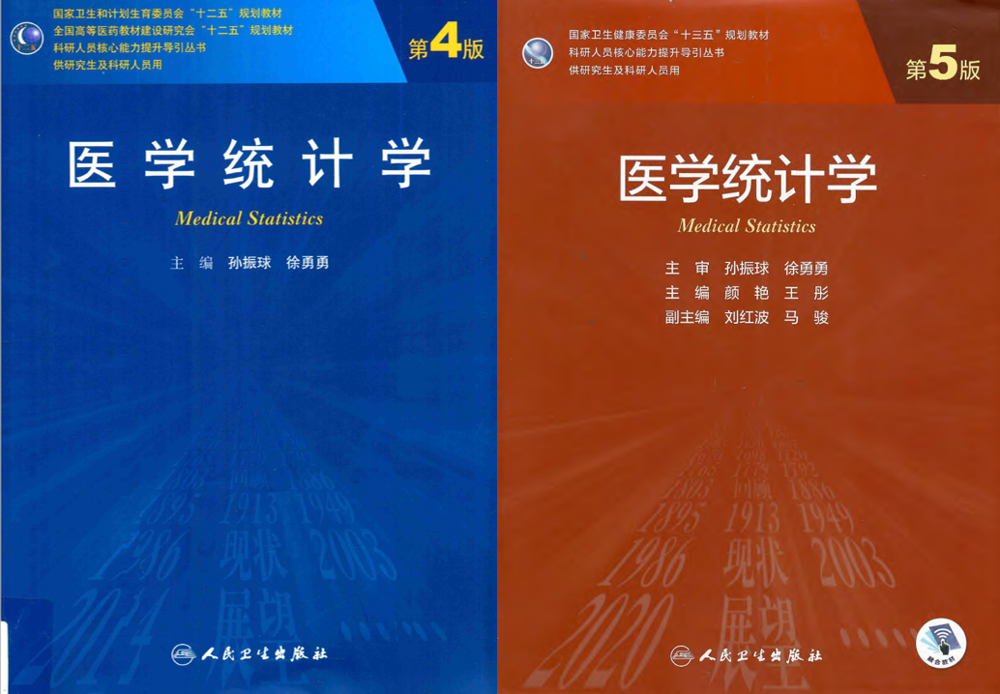

# R语言实战医学统计

📘 一本面向医学科研人员的开源教程，讲解如何使用R语言进行统计分析与科研绘图。  

🔗 GitHub地址：[https://ayueme.github.io/R_medical_stat](https://ayueme.github.io/R_medical_stat) 

🕮 本书在线观看地址：[https://ayueme.github.io/R_medical_stat](https://ayueme.github.io/R_medical_stat)

📺 配套视频教程观看地址：[阿越就是我个人主页-哔哩哔哩视频](https://space.bilibili.com/42460432)

>📢 **本书持续更新中！**  
>
>**✨ 最新更新日期 (202-12-24，第8次更新)**      
>
>[👉 点击这里查看详细的更新日志](CHANGELOG.md)

## 许可证（License） 

本书所有内容（文字、代码、图表、示例、教学材料）采用[知识共享 署名-相同方式共享 4.0 国际许可协议](https://creativecommons.org/licenses/by-sa/4.0/deed.zh)（CC BY-SA 4.0）授权。 

### 使用要求： 

- ✅ **允许**：分享、改编、商用、教学使用； 
- 📝 **必须**：  
  - 署名原作者 **阿越就是我**；  
  - 提供原始链接（本仓库）；  
  - 衍生作品**必须同样使用CC BY-SA 4.0**发布。 

### 正确署名示例： 

> 本内容改编自 阿越就是我 的《R语言实战医学统计》（https://github.com/ayueme/R_medical_stat），   
>
> 采用 CC BY-SA 4.0 许可证发布（https://creativecommons.org/licenses/by-sa/4.0/deed.zh）。 

> 💡 本书为开源教育项目，欢迎提 Issue、PR 或用于教学推广！

## 本书缘起

R语言是一门编程语言，但同时也是一个统计软件，R语言是由统计学家开发的，所以天生就适合做统计。

很多刚接触R语言的朋友不知道如何入手，只知道目前R语言在临床医学领域很火爆，做统计分析、画图、做生信分析、孟德尔随机化、数据库挖掘等都离不开R语言。

万事开头难，我非常理解新手面对R语言的痛苦，因为我也是从0开始的，作为从未接触过编程的医学生/医生来说，初学R语言简直就是读天书！我最开始接触R语言是因为偶然间听师兄师姐说R语言可以做统计学，当时的我对SPSS的使用不熟练，觉得SPSS的使用步骤太多，难以记住，于是入了R语言的坑...没想到从此一发不可收拾，打开了新世界的大门。

这个系列也是我最开始学习R语言时的笔记，在我的公众号：**医学和生信笔记**，都可以找到，现在对原内容进行重新整理，并把数据一起打包，方便有需要的同学学习。

> 本书不适合R语言零基础的人。如果你是刚入门的小白，我首先推荐你了解下R语言的基础知识，比如R语言和R包安装、Rstudio的界面、R语言中数据类型（向量、矩阵、数据框、列表等）、R语言中的数据导入导出、R语言的基础数据操作等。

我结合自己学习R语言时的经验，也专门为编程零基础的医学生/医生等群体录制了[R语言零基础入门](https://space.bilibili.com/42460432/channel/collectiondetail?sid=3740949)的视频教程，已放在B站，且配套文档、数据都是免费的，无任何套路。各种在初学R时遇到的“坑”，我都替你踩过了，并且也在视频中指出来了。**强烈建议没接触过R语言的朋友先去了解下基础知识，切勿直接上手实操！**

然后你就可以跟着本系列一起学习R语言在医学统计学中的使用。这个系列非常适合初学者，因为有很多内容是按照课本来的，尤其是基础统计分析部分，完全使用R语言复现课本中的例题，得到结果后可以与课本对照！我使用的课本是孙振球主编的《医学统计学》第4版以及第5版，封面如下：

由于R和SPSS在进行统计分析时的一些数学计算方面并不是完全一致，所以导致有些结果和课本中的结果有些出入，但是并不影响结果的正确性。

本系列还有配套的视频教程，也在B站，免费观看，点击直达：[R语言实战医学统计](https://space.bilibili.com/42460432/channel/collectiondetail?sid=3977492)

> 本书实际上是我公众号部分历史推文的整理和汇总（部分内容有改动），**书中涉及的所有数据都可以在相关历史推文中免费获取**！推文合集链接：[医学统计学](https://mp.weixin.qq.com/mp/appmsgalbum?__biz=MzUzOTQzNzU0NA==&action=getalbum&album_id=2231476971388059661&scene=126#wechat_redirect)

> 我也准备了一个PDF版合集(附赠Word版)，内容和网页版一致，只是打包了所有的数据，付费获取（10元，1次付费，长期更新，无需重复付费），介意勿扰！**PDF版合集获取链接**：[R语言实战医学统计](https://mp.weixin.qq.com/s/uzL8Y2nZ3W4efA4q8xJ5UA)

限于本人水平等问题，难免会有一些错误，欢迎大家以各种方式批评指正，比如公众号留言、粉丝QQ群、github、个人微信等。

## 作者简介

- 阿越，外科医生，R语言爱好者，长期分享R语言和医学统计学、临床预测模型、生信数据挖掘、R语言机器学习等知识。
- 哔哩哔哩：[阿越就是我](https://space.bilibili.com/42460432)
- 知乎：[医学和生信笔记](https://www.zhihu.com/people/li-xiao-yue-65-90)
- CSDN：[医学和生信笔记](https://blog.csdn.net/Ayue0616)
- Github：[ayueme](https://github.com/ayueme)
- 公众号：**医学和生信笔记**，欢迎扫码关注：

